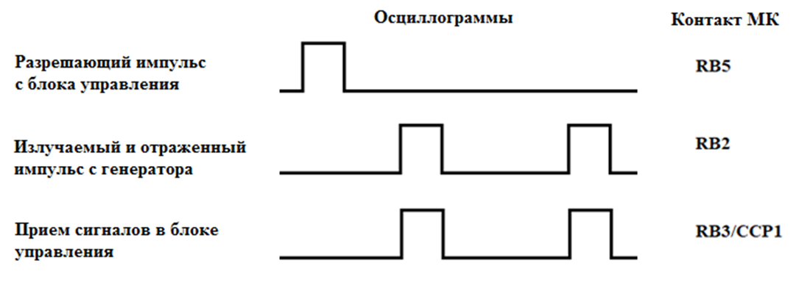
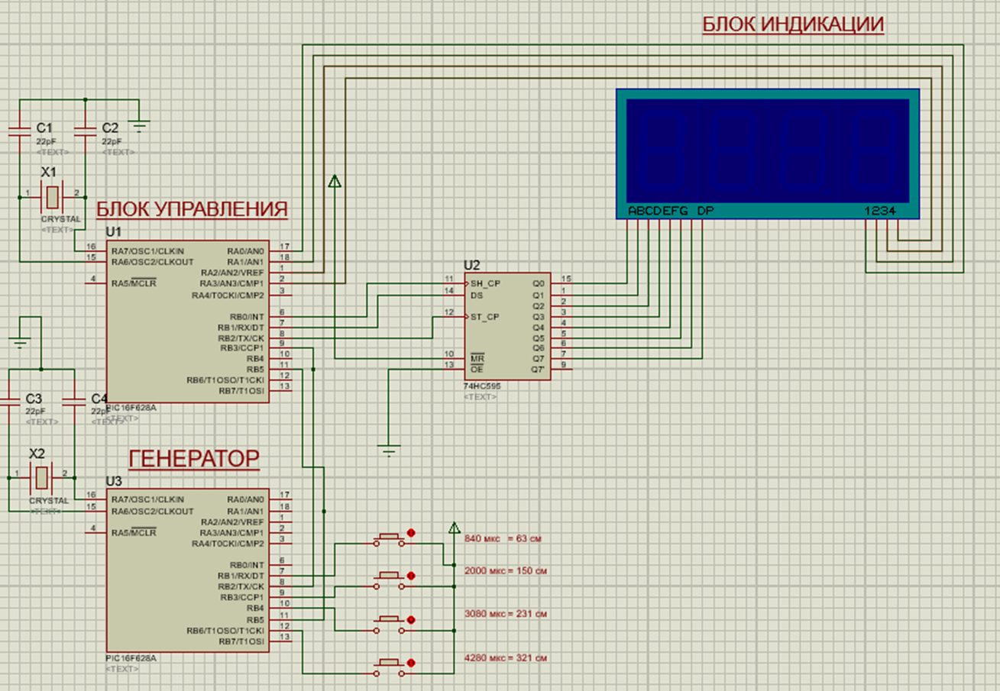
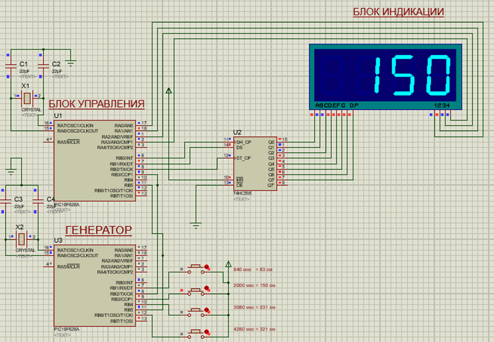
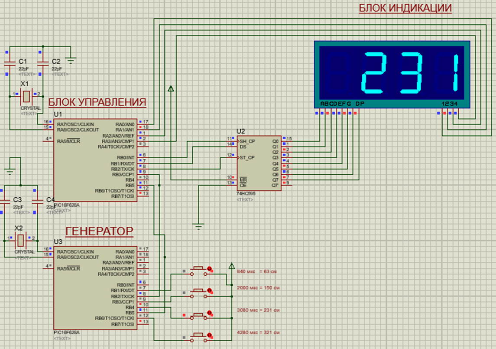

# Описание проекта

**_Симулятор работы эхолота на базе микроконтроллера PIC16F628A в среде проектирования электронных схем Proteus_**

В качестве блока управления эхолота используется микроконтроллер PIC16F628A. Блок управление должен выполнять следующие функции:

-   Подача разрешающего импульса для запуска генератора зондирующих импульсов
-   Обработка излучаемого и отраженного импульса, вычисление задержки между ними
-   Вычисление глубины по данным задержки излучаемого и отраженного импульса по приведенной ниже формуле. Считая, что время задержки вычисляется в микросекундах и результат расчета глубины нужно представить в сантиметрах:
    $$D = \frac{t \times 75}{1000}$$
-   Вывод рассчитанных данных о глубине на блок индикации.

Если представить работу блока управления с генератором зондирующих импульсов в виде осциллограмм, то в начале работы эхолота происходит передача разрешающего импульса для генератора, по принятию данного импульса генератор формирует и отправляет в блок управления, излучаемый и отраженный импульс. После расчета задержки между излучаемым и отраженным импульсом, блок управления снова отправляется разрешающий импульс и переходит в режим ожидания импульсов с генератора. Прошивка для блока управления реализована на языке assembler - [блок управления](/src/main%20block/exo.asm)

В качестве блока индикации выбран 4-х разрядный 7-сегментный индикатор 7SEG MPX4. Для работы с этим индикатором необходимо использовать минимум 10 контактов микроконтроллера для вывода 3-хзначных чисел. В данном случае для используемого микроконтроллера PIC16F628A невозможно использовать такое количество ножек. Поэтому для управления индикатором будет использоваться микросхема сдвигового регистра 74HC595.

Для симуляции работы генератора зондирующих импульсов и отраженных сигналов используется микроконтроллер PIC16F628A. [прошивка](/src/generator/pic2.asm)

### 🖼️ Сборка схемы и моделирование работы эхолота

Схема состоит из трех основных блоков: блок управления, генератор и блок индикации. Связь между блоком управления и генератором импульсов происходит следующим образом:

-   С блока управления разрешающий импульс подается через RB5 на контакт микроконтроллера генератора RB5;
-   С ножки RB2 генератора излучаемый и отраженный импульс идут на RB3 блока управления;
-   Кнопки для изменения задержки между импульсами подключены к RB1, RB3, RB4, RB6 микроконтроллера для симуляции генератора, соответственно 840, 2000, 3080, 4280 мкс;
    Также к блоку управления подключен сдвиговый регистр, которому подключается 4-хразрядный 7-мисегментный индикатор

Cхема эхолота в среде проектирования электронных схем Proteus - [тут](hardware/Echosounder.pdsprj)

### 🔧 Результат моделирования работы эхолота при 2000 мкс в среде проектирования Proteus

### 🔧 Результат моделирования работы эхолота при 2000 мкс в среде проектирования Proteus

